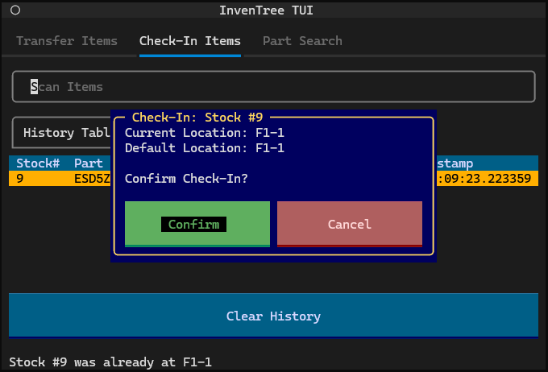
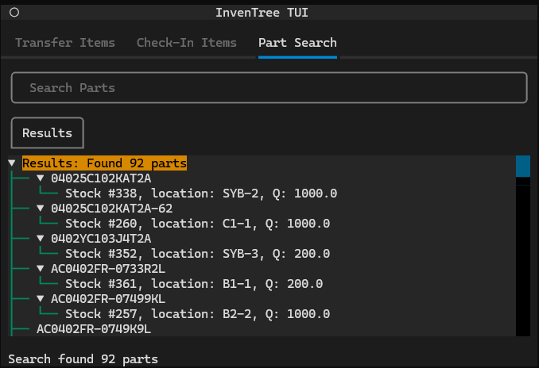

# InvenTree TUI

Terminal User Interface for InvenTree, built with [Textual](https://github.com/Textualize/textual). Project maintained on [GitHub](https://github.com/j-huff/inventree-tui).        

## Installation

InvenTree TUI can be install via PyPi using the command `pipx install inventree-tui`. Using `pipx` rather than `pip` installs the application in its own virtual environment, ensuring that the dependencies of different applications do not conflict with it.

Once installed, launch the TUI using the command `inventree-tui` or by running the library module as a script (`python -m inventree-tui`). You will have to configure the required environment variables first (see below).

## Configuration

To run inventree-tui, you must set the following environment variables: `INVENTREE_API_HOST`, `INVENTREE_API_TOKEN`

You can also set these in a file named `.env`:

```
# .env file
INVENTREE_API_HOST=https://example.com/
INVENTREE_API_TOKEN=inv-xxxxxxxxxxxxxxxxxxxxxxxxxxxxxxxxxxxxxxxx-xxxxxxxx
```

## Usage

After installation, InvenTree TUI is launched using the command `inventree-tui`. The app can be navigated using either the mouse or keyboard. The keyboard navigation controls are as follows:

- `tab`: Focus next item
- `shift + tab`: Focus previous item
- `arrow keys`: Change selection
- `enter`: Activate
- `delete`: Remove item from list

The app is composed of several tabs, each with a specific function.

### Transfer Items Tab

This tab is used for transferring stock items to a different location. First, scan the destination location barcode. Next, scan the barcodes of the items you wish to transfer to this location. If you accidentally scan the wrong item, you can remove it from the list using the `delete` key. Once you are done scanning items, hit the `Done` button and the items will be tranferred to the destination location.


### Check-In Items Tab

This tab is used for transferring stock items to their default locations. Simply scan an item barcode and confirm the transfer with the pop-up dialog. A history of checked-in items is kept for convient reference, and can be cleared using the `Clear History` button.



### Part Search Tab

This tab is used for searching the inventory for parts. Each part in the results can be expanded using the `Enter` key, which will then fetch and display the relevant stock items and their locations and quantities. The first few parts in the results are expanded automatically.


